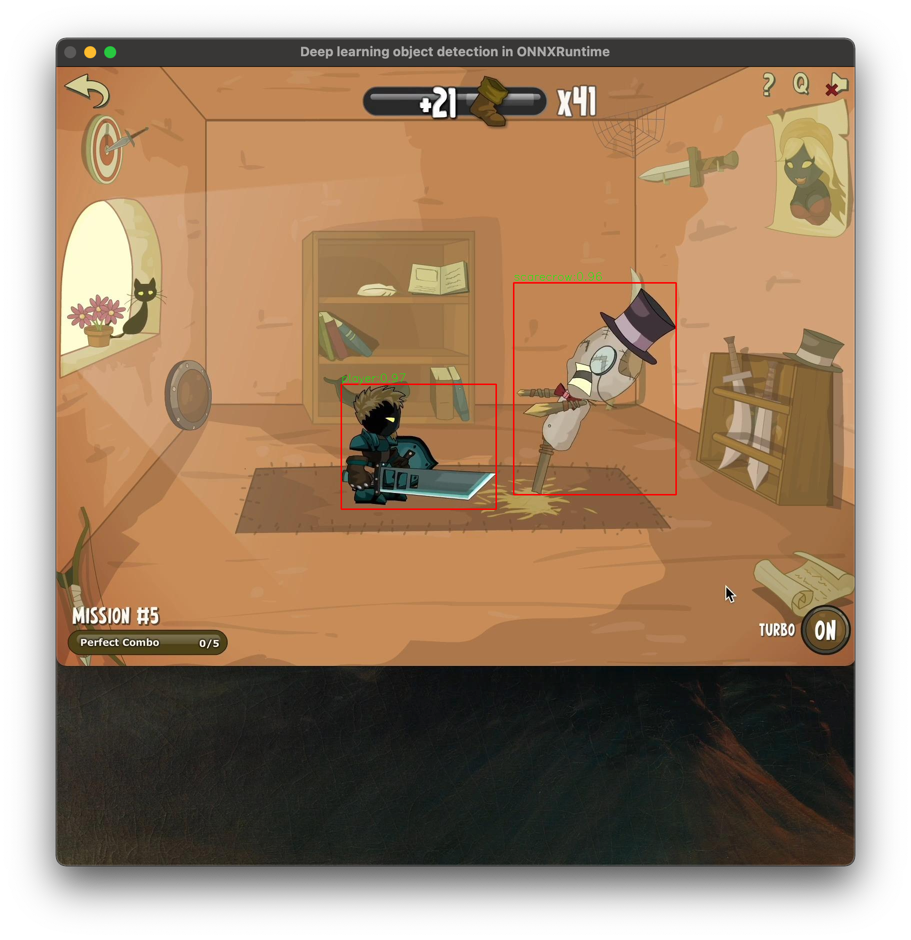
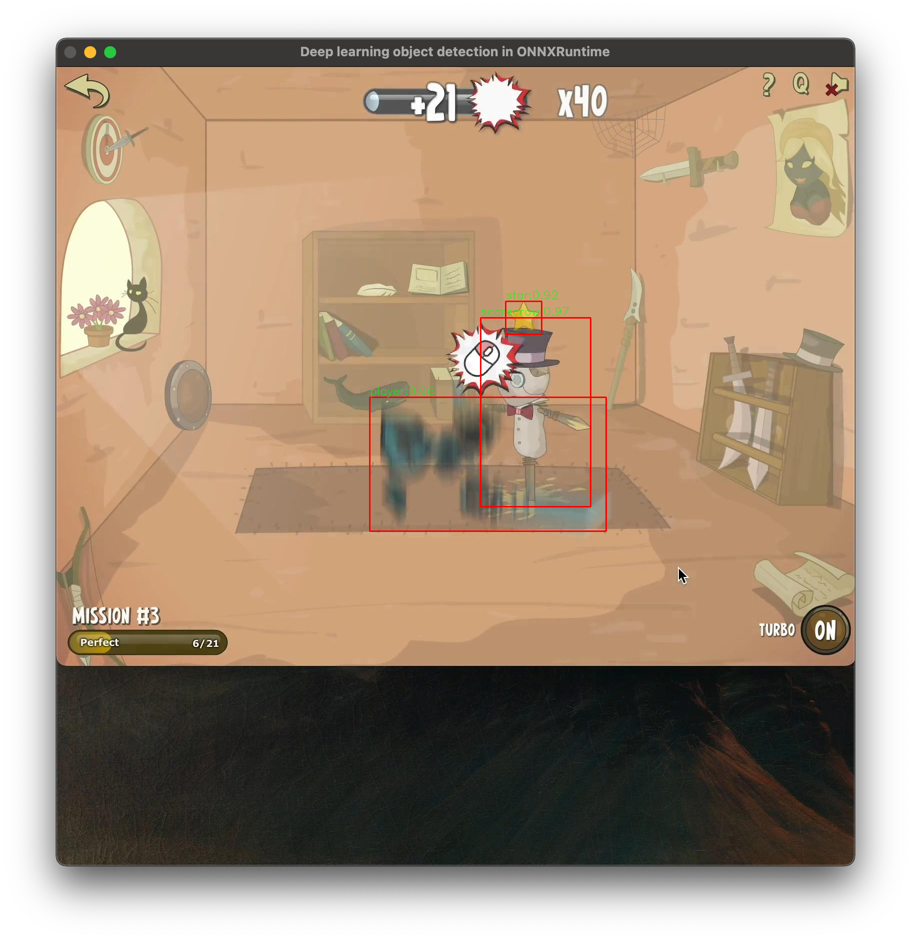
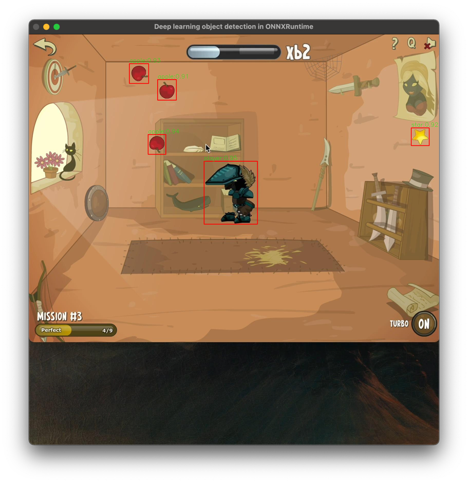

# YOLO CMake OpenCV ONNX CPP

Implementation is basically cleaned up version of [hpc203/yolov7-opencv-onnxrun-cpp-py](github.com/hpc203/yolov7-opencv-onnxrun-cpp-py) repo.

This repository is more of a documentation for my own purposes to show how to run these libraries with CMake. Maybe someone else will find this useful.

## How to run

1) Install dependencies:
```bash
$ brew install cmake
$ brew install onnxruntime # optional
$ brew install opencv
```

2) If you are on M1 then you are good to go 🎉

3) **If you are not on M1** then download ONNX Runtime
- Either pick correct version from releases [here](github.com/microsoft/onnxruntime/releases)
- If you are not sure what version to download use the official optimize inferencing picker [here](https://onnxruntime.ai)

4) Put ONNX runtime files to `external/`
5) Point `ONNXRUNTIME_ROOT` in CMakeList.txt to your onnxruntime root folder

## Model

- This example uses custom trained model
- You can use any model you want - don't forget to update `coco.names` file if you do 🙌

## Preview




