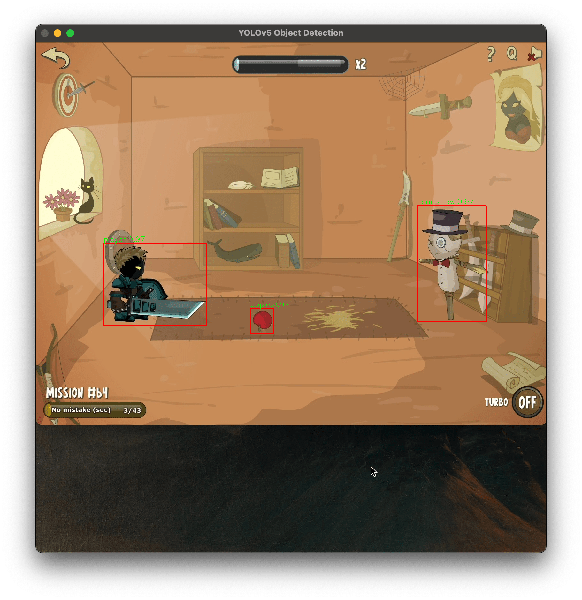
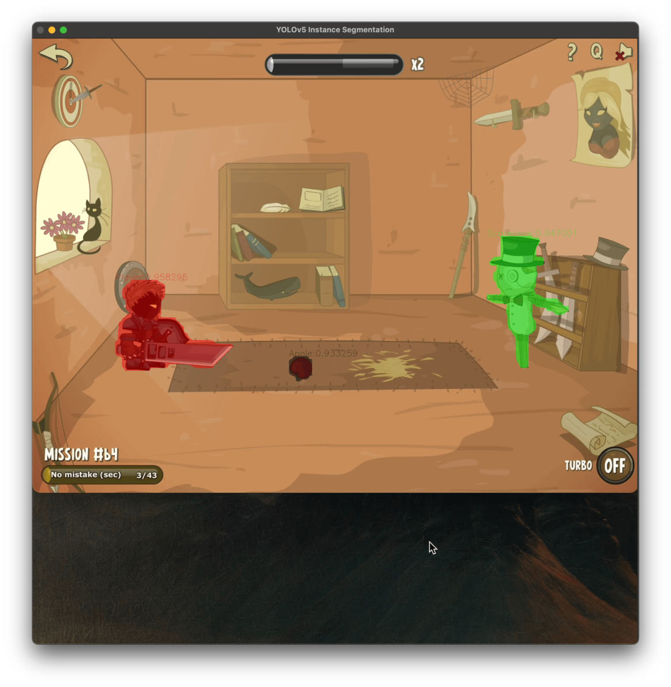
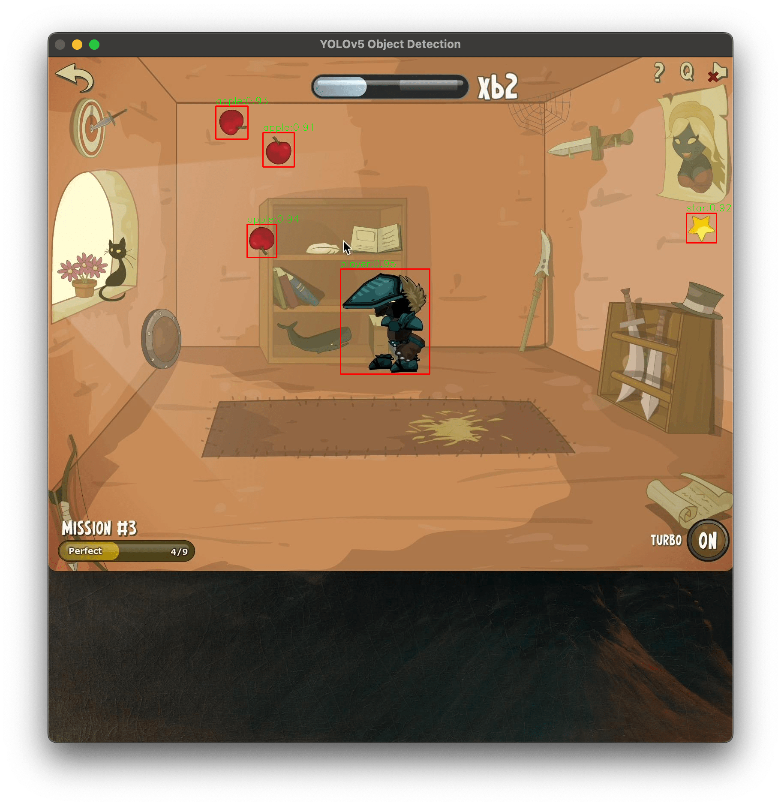
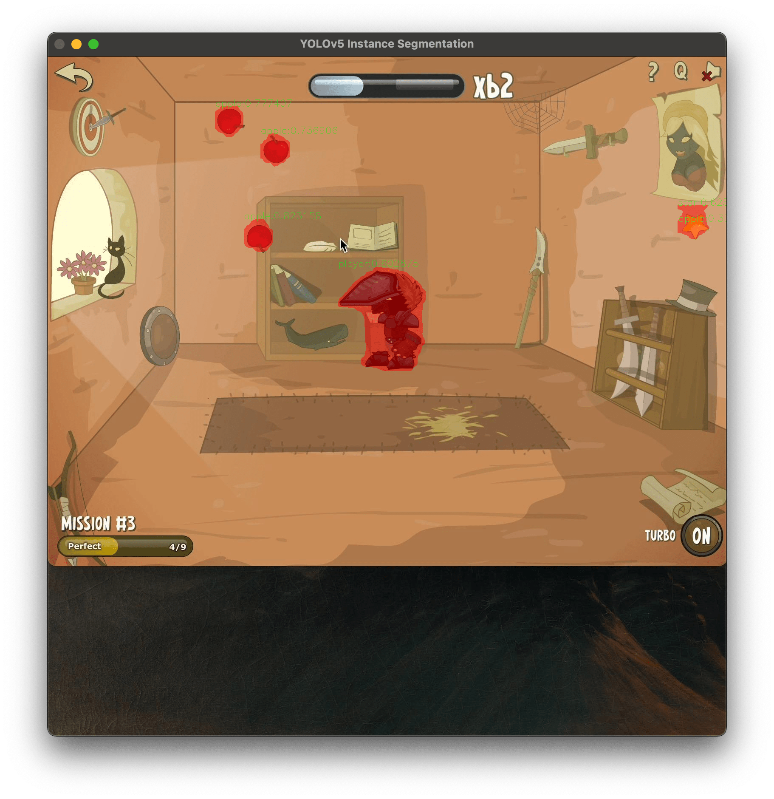
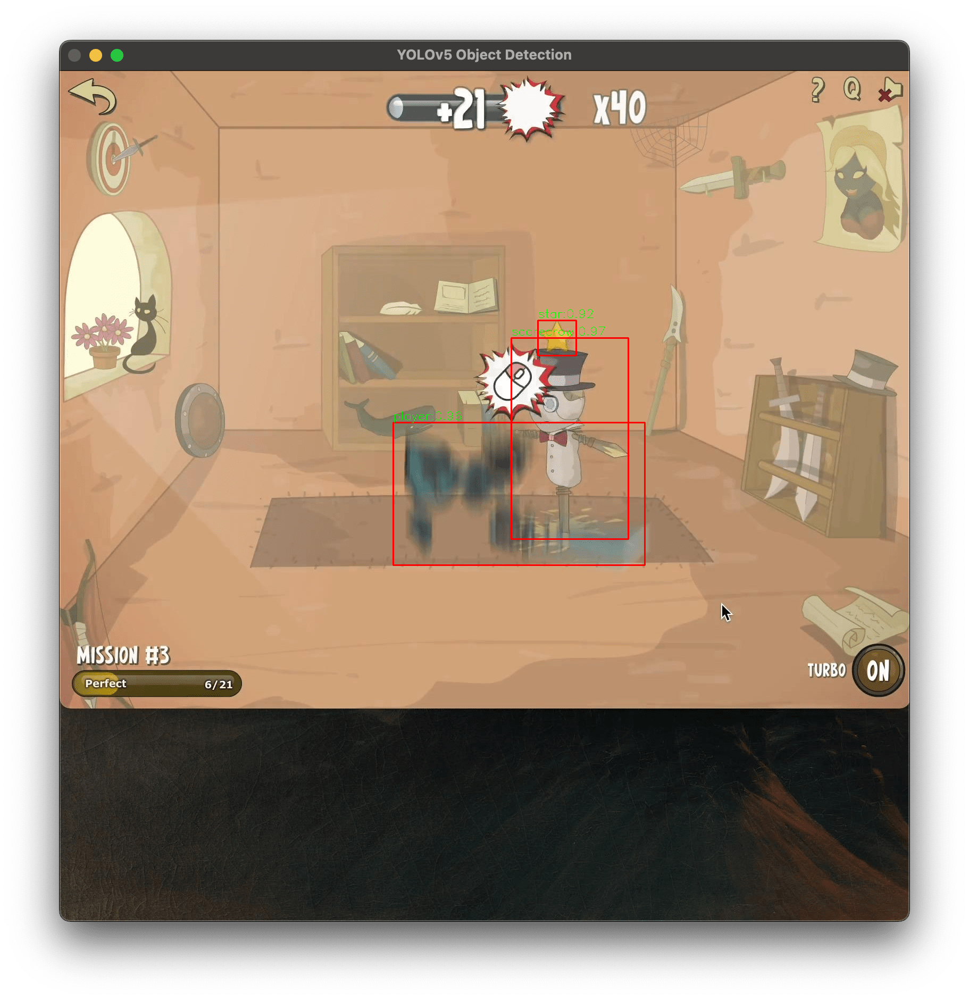

# YOLO CMake OpenCV ONNX CPP


Object detection implementation is inspired
by [hpc203/yolov7-opencv-onnxrun-cpp-py](https://github.com/hpc203/yolov7-opencv-onnxrun-cpp-py)

This repository serves mostly as documentation for my personal use, demonstrating how to use ONNX and OpenCV with CMake
on MacOS.

## How to run

1) Install dependencies:

```bash
$ brew install cmake
$ brew install onnxruntime 
$ brew install opencv
```

2) If you are on M1 then you are good to go 🎉


3) **If you are not using an M1 processor**, download ONNX Runtime.

- Either select the correct version from the releases available [here](github.com/microsoft/onnxruntime/releases)
- If you are unsure which version to download, you can use the official optimize inferencing
  picker [here](https://onnxruntime.ai)

4) Put ONNX runtime files to `external/`


5) Set `ONNXRUNTIME_ROOT` .env variable to your onnxruntime folder name

## Model

- This example utilizes a custom-trained model. If you wish to train your own model, you can create a dataset
  using [Roboflow](https://roboflow.com/#annotate) and then use one of
  their [official notebooks](https://github.com/roboflow/notebooks) to perform the training. There are also many
  comprehensive tutorials in the official [ultralytics/yolov5 repository](https://github.com/ultralytics/yolov5)
- You are free to use any model you prefer, but be sure to update the `class.names` file accordingly. Additionally, for instance segmentation, it is important to pass `SegNetConfig` with proper parameters. 

## Preview

**Object detection dataset information:**
- 186 training images
- 57 validation images
- 25 test images

**Instance segmentation dataset information:**

- 63 training images (AUGMENTATION rotation: Between -15° and +15°)
- 6 validation images
- 4 test images









