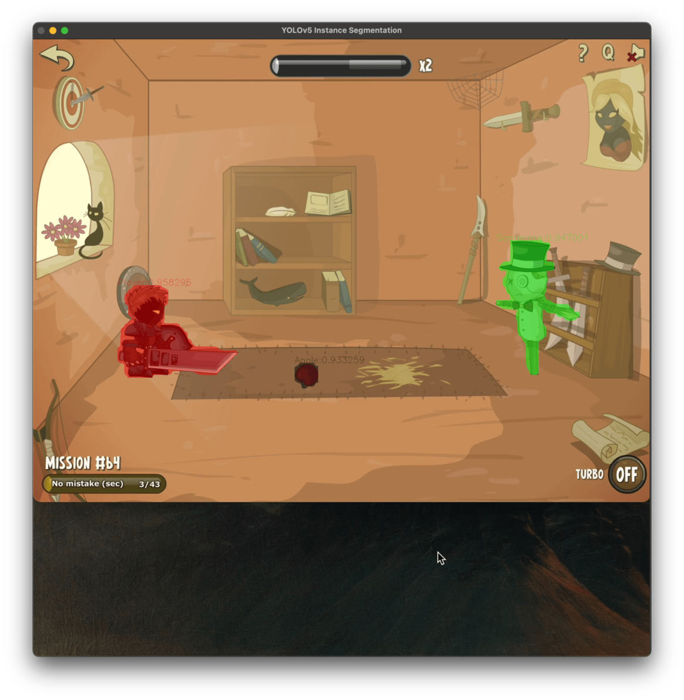
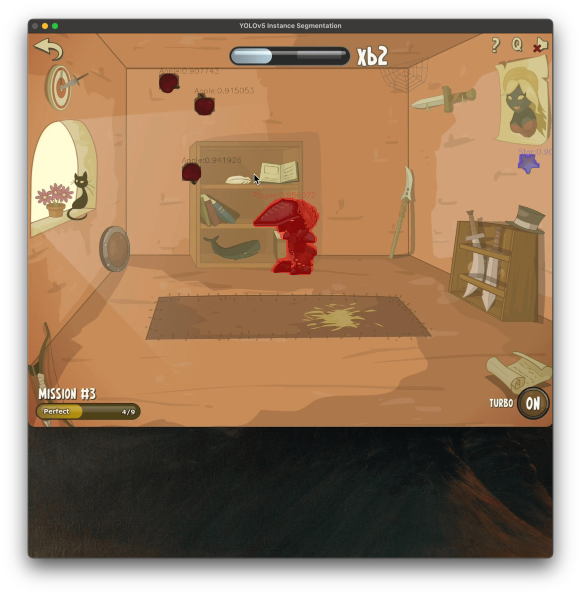
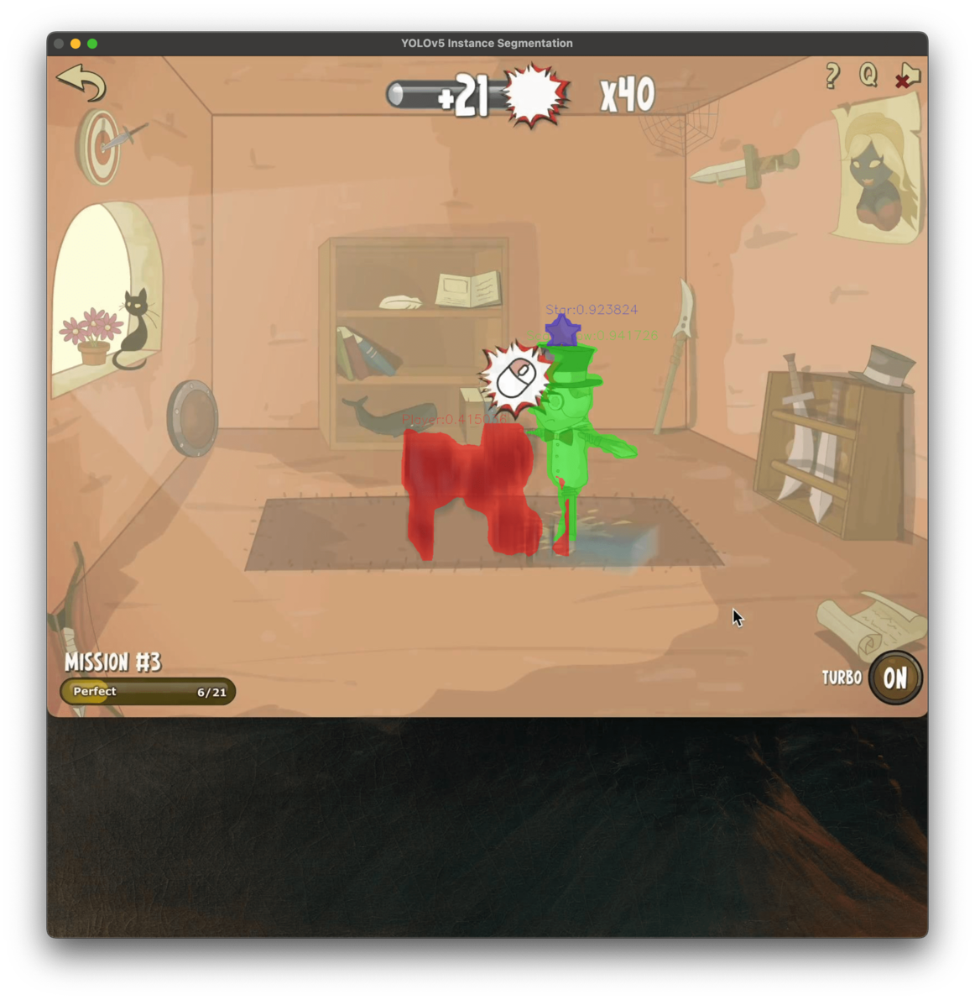

# YOLO CMake OpenCV ONNX CPP


Object detection implementation is inspired
by [hpc203/yolov7-opencv-onnxrun-cpp-py](https://github.com/hpc203/yolov7-opencv-onnxrun-cpp-py)

This repository serves mostly as documentation for my personal use, demonstrating how to use ONNX and OpenCV with CMake
on MacOS.

## MacOS installation

1) Install dependencies:

```bash
$ brew install cmake
$ brew install onnxruntime 
$ brew install opencv
```

2) If you are on ARM then you are good to go 🎉

3) **If you are not using an ARM processor**, [download correct runtime 1.12.1 header files from the official GitHub repository](https://github.com/microsoft/onnxruntime/releases/tag/v1.12.1).

4) Put onnxruntime files to `external/`

5) Set `ONNXRUNTIME_ROOT` env variable to your onnxruntime folder name

## Windows installation

1) Install dependencies:

```bash
$ choco install cmake --pre
$ choco install opencv
```

2) Download [ONNX Runtime 1.12.1](https://github.com/microsoft/onnxruntime/releases/download/v1.12.1/onnxruntime-win-x64-1.12.1.zip)
3) Extract and put onnxruntime folder to `external/onnxruntime-win-x64-1.12.1`

## Model

- This example utilizes a custom-trained model. If you wish to train your own model, you can create a dataset
  using [Roboflow](https://roboflow.com/#annotate) and then use one of
  their [official notebooks](https://github.com/roboflow/notebooks) to perform the training. There are also many
  comprehensive tutorials in the official [ultralytics/yolov5 repository](https://github.com/ultralytics/yolov5)
- You are free to use any model you prefer, but be sure to update the `class.names` file accordingly. Additionally, for instance segmentation, it is important to pass `SegNetConfig` with proper parameters.

## Preview

100 epochs. Trained on YOLOv5n-640 models. Inference on M1 CPU takes ~40ms.

**Object detection dataset information:**
- 186 training images
- 57 validation images
- 25 test images

**Instance segmentation dataset information:**

- 540 training images (AUGMENTATION rotation: Between -15° and +15°)
- 53 validation images
- 28 test images









